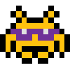

# Outvaders

Project done as a part of the interview proccess at Warhorse Studios. I was given a broken [Space Invaders](https://en.wikipedia.org/wiki/Space_Invaders) game with unfinished library in C++ using `Windows`, `Direct3D` and `FMOD` libraries. My job was to make the game playable, document the proccess and to create overall clean application from the starting point I was given.

## Added features
- Collision detection
- New Sprites and textures
- Utility function for the library
- Entities
- Highscores
- Menus
- And a lot more

## Game Controls

### Game
- move left:    left arror
- move right:   right arrow
- shoot:        space
- exit:         esc
- pause game:   P

### Menu navigation
- move up:      up arrow
- move down:    down arrow
- pick:         enter

## Documentation 

This project includes Doxygen config file, to create documentation navigate to projects folder and run `doxygen Doxyfile`. If you use GUI Doxywizard, simply press File->Open and navigate to Doxyfile in projects directory. Then click Run->Run doxygen.

After Doxygen has run, documentation will be located in doc directory, navigate to `index.html` and browse the docs in any browser.

## What do I want to implement next

If I will find a time throughout my next semester I would like to add sound and a two players mode.

## Some bad practices
Some of the bad practices I didn't have time to sort out are enum return values, in some handling function I am returning simply an integer, which works great, but sadly isn't that readable. I wanted to add enums, but didn't find the time for that.

I just found out that making user install font is a very bad practice and the font should be only loaded inside our project using C++ libraries, which makes sense, I am planning to implement it down the road, because right now user has to install the font manually.

## Memory leaks
I left CRT debugger libraries and code in source code so you can check memory leaks. These memory leaks are probably false positives, because I managed to clear all my internal leaks and all of them were shown line in source code they occured, memory leaks that are left don't do that and CRT is prone to false positives. To see the memory leaks simply run the program with Local Windows Debugger in Visual Studio.

## Getting Started

### Prerequisites
- Visual Studio 2008 or higher

### Installation

## Running the app
1. Clone the repository: git clone https://github.com/schrodlm/outvaders.git
2. Navigate to the server directory: `cd outvaders`
3. Open `outvaders.sln` Visual Studio solution
4. Build the application withing the Visual Studio

Also game uses custom font, font file is located inside a game directory I added font installation as a part of building the project in Visual Studio but I am not sure it works as intended, in case it doesn't you will have to install the font manually. Simply click the `CosmicAlien.ttf` and install it.

## Built With
- [Visual Studio](https://visualstudio.microsoft.com/) - IDE FOR Windows software development
- [Direct3D](https://learn.microsoft.com/en-us/windows/win32/direct3d) - Direct3D is a graphics application programming interface

## Authors
- [Matěj Schrödl](https://github.com/schrodlm) - source code
- Yen Nhi Tranová - sprites and bitmaps design

